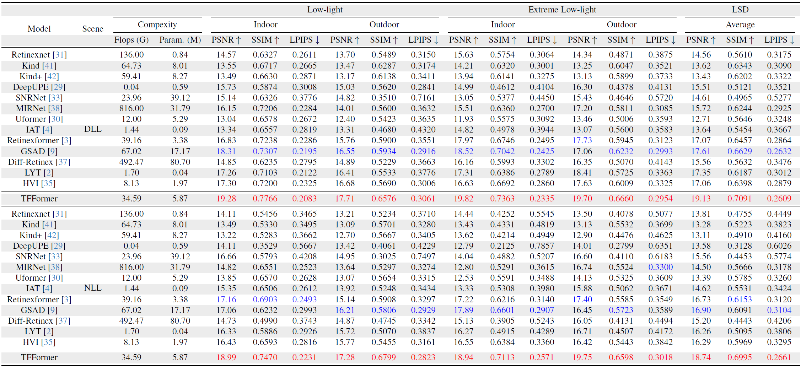

# [WACV 2026] Illuminating Darkness: Learning to Enhance Low-light Images In-the-Wild

[](https://arxiv.org/abs/2503.06898)

## Description
This is the official repository for our paper titled "Illuminating Darkness: Learning to Enhance Low-light Images In-the-Wild".


## Abstract
Single-shot low-light image enhancement (SLLIE) remains
challenging due to the limited availability of diverse, realworld paired datasets. To bridge this gap, we introduce
the Low-Light Smartphone Dataset (LSD), a large-scale,
high-resolution (4K+) dataset collected in the wild across
a wide range of challenging lighting conditions (0.1–200
lux). LSD contains 6,425 precisely aligned low and normallight image pairs, selected from over 8,000 dynamic indoor and outdoor scenes through multi-frame acquisition
and expert evaluation. To evaluate generalization and aesthetic quality, we collect 2,117 unpaired low-light images
from previously unseen devices. To fully exploit LSD, we
propose TFFormer, a hybrid model that encodes luminance
and chrominance (LC) separately to reduce color-structure
entanglement. We further propose a cross-attention-driven
joint decoder for context-aware fusion of LC representations, along with LC refinement and LC-guided supervision to significantly enhance perceptual fidelity and structural consistency. TFFormer achieves state-of-the-art results on LSD (+2.45 dB PSNR) and substantially improves
downstream vision tasks, such as low-light object detection
(+6.80 mAP on ExDark).

## **Installation**
```bash

# 1. Clone the repository
git clone <repo_link>
cd <repo_folder>

# 2. Create and activate a virtual environment (Python 3.10 recommended)

# Create venv
python -m venv .venv

# Activate (Linux/macOS)
source .venv/bin/activate

# 3. Install dependencies
pip install --upgrade pip
pip install -r requirements.txt

# 4. Download the dataset
# Refer to the "Dataset" section for download links and directory structure.

```

---

## **Dataset: Low-light Smartphone Dataset (LSD)**
We introduce **LSD**, the largest in-the-wild Single-Shot Low-Light Image Enhancement (SLLIE) dataset to date.

📥 **Download Dataset:** [Link](https://drive.google.com/drive/folders/1QPT6vbRlA-47N0xNElmVYYR6hx9hGZiw?usp=sharing)


Dataset directory structure:
```
testing

training
    full_scenes/
    patches/
        ├── inputPatchDLL/
        ├── gtPatchDLL/
        ├── inputPatchNLL/
        └── gtPatchNLL/
```

### **Terminology**
- **DLL — Denoised Low-Light:** for low-light enhancement training  
- **NLL — Noisy Low-Light:** for joint denoising + enhancement training  


---

## **Usage**
Update your dataset paths in `mainModule/config.json`:
```python
"gtPath": "./lsd/gtPatch/",         # path to groundtruth patches
"targetPath": "./lsd/inputPatch/",  # path to input patches
"testImagePath": "./lsd_test/"      # path to test set contining gtPatch & inputPatch folders
```

### **Train from scratch**
```bash
python main.py -ts
```

### **Transfer learning / Resume training**
Update `mainModule/config.json` to point to your checkpoint for example:
```json
"checkpointPath": "./modelLog/LowLightEnhancement/checkpoint_TFFormer/"
```

Then run:
```bash
python main.py -tr
```

Checkpoints and enhanced images are stored in `modelLog` folder during training.

⚠️ **Note:**  
For transfer learning, ensure the training steps/epochs in your config exceed those of the pretrained checkpoint. Otherwise, update the code logic to avoid training from stopping early.

---

## **Results**
Sample results and visualizations will be uploaded after publication.
### Quantitative Benchmark on LSD Dataset

<p align="center">
  
</p>
*The best and second-best results are highlighted in red and blue respectively.*
---

## **Citation**
You can cite our preprint as:

```bibtex
@article{sharif2025illuminating,
  title={Illuminating darkness: Enhancing real-world low-light scenes with smartphone images},
  author={Sharif, SMA and Rehman, Abdur and Abidin, Zain Ul and Naqvi, Rizwan Ali and Dharejo, Fayaz Ali and Timofte, Radu},
  journal={arXiv preprint arXiv:2503.06898},
  year={2025}
}
```
---

## **License**

### Code License
The code in this repository is licensed under the **MIT License**. See [LICENSE](LICENSE) for details.

### Dataset License
The **Low-Light Smartphone Dataset (LSD)** is licensed under **Creative Commons Attribution 4.0 International (CC BY 4.0)**. See [DATA_LICENSE](DATA_LICENSE) for details.


## **Contact**
For any further query, feel free to contact us through the following emails: apuism@gmail.com, abdurehman458@gmail.com

**Acknowledgment:** This code is based on the [BDJJ](https://github.com/sharif-apu/BJDD_CVPR21) and  [RetinexFormer](https://github.com/caiyuanhao1998/Retinexformer) repository. 
